

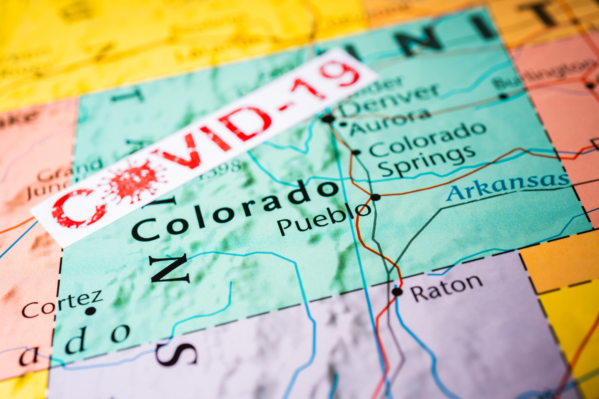

# COVID-19 Colorado Hispanic Disparity

## Introduction
The population of Colorado is comprised of 30% hispanic citizens, but 60% of the COVID-19 cases are afflicting hispanic people, far outweighing any other ethnicity. In this project, I am exploring trends in environmental factors, education, english fluency, and food availability in regions of the state with high hispanic populations to determine possible reasons for this disparity.

This project is in collaboration with Sandra Halvatzis/Halvatzis Consulting for Colorado Hispanic Chamber of Commerce on Market Insights Report # 1002 - Driving Equitable Growth in Colorado: A Look Back to Move Forward.

Please note that all the figures shown below are linked to the Tableau Public interactive version and can be further explored.

### Hispanic Population/Density by County
This figure shows the percentage of hispanic people per county (shaded in blue) and the population of hispanics in said county is labeled. The bar graph shows another representation.

<a href="https://public.tableau.com/shared/JCBFRJDR6?:display_count=y&:origin=viz_share_link">
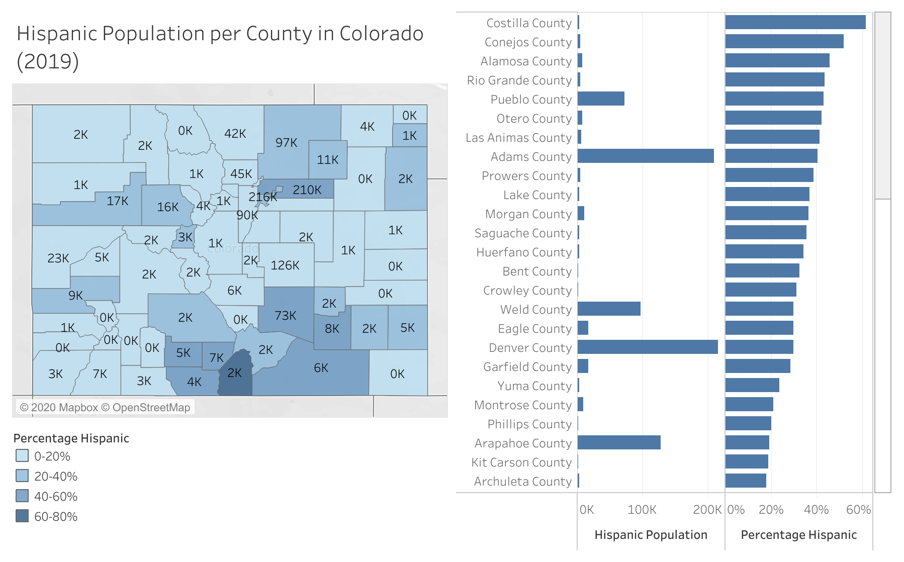</a>

## Environmental Factors

### AQI Max 2018 Map
This map shows the maximum recorded air quality index level for each county in Colorado in the year of 2018. The circles on the map represent the percent and population of hispanic people per each county, respectively.

Air Quality Index is an indicator of overall air quality, because it takes into account all of the criteria air pollutants measured within a geographic area. AQI includes all available pollutant measurements from each monitoring station. They include both qualitative measures (days of the year having "good" air quality, for example) and descriptive statistics (median AQI value, for example) [[Source](https://www.epa.gov/outdoor-air-quality-data/about-air-data-reports#aqi)]

### AQI Median 2018 Plot
This plot shows the median Air Quality index in 2018 for each county in Colorado that has data recorded from the Environmental Protection Agency (EPA). There appears to be a positive correlation between the size of the population and the median air quality index level. It it worth noting that many of the counties exhibiting a higher AQI have high hispanic populations.

<a href="https://public.tableau.com/views/COHispanicCounties-Display/AQIMedian2018Doc?:language=en&:display_count=y&:origin=viz_share_link">
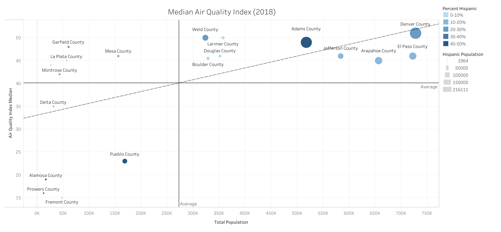</a>

### Most Polluted Zip Codes in Colorado
The most polluted zip codes in Colorado, according to the Denver post are plotted in the map below. The zip code 80216 has an extremely high environmental hazard index, and also a very high concentration of hispanic people. The next most polluted zip codes do not appear to be nearly as hazardous, but generally have a smaller percentage of hispanic residents.

<a href="https://public.tableau.com/views/ZipCodeEnvironmentalHazard-Display/MostPollutedZipCodes?:language=en&:display_count=y&publish=yes&:origin=viz_share_link">
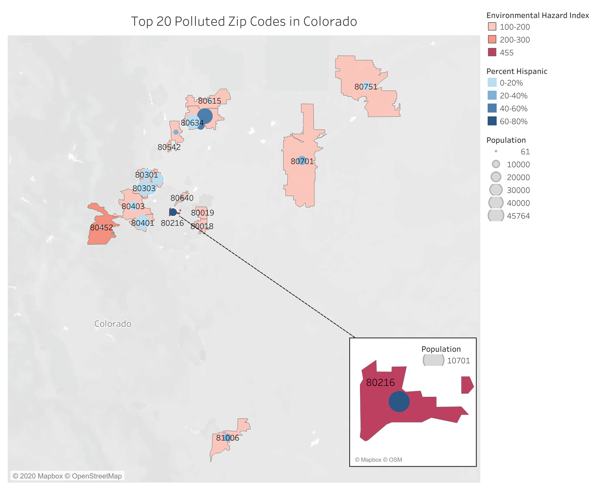</a>

## Education

### Hispanic Graduation Rates by County
This map shows the class of 2018-2019 graduation rates of hispanic people over the counties of Colorado. There appears to be much lower rates in rural counties, though few of them are highly hispanic.

<a href="https://public.tableau.com/views/COHispanicCounties-Display/HispanicGraduationRatesbyCountyDoc?:language=en&:display_count=y&:origin=viz_share_link">
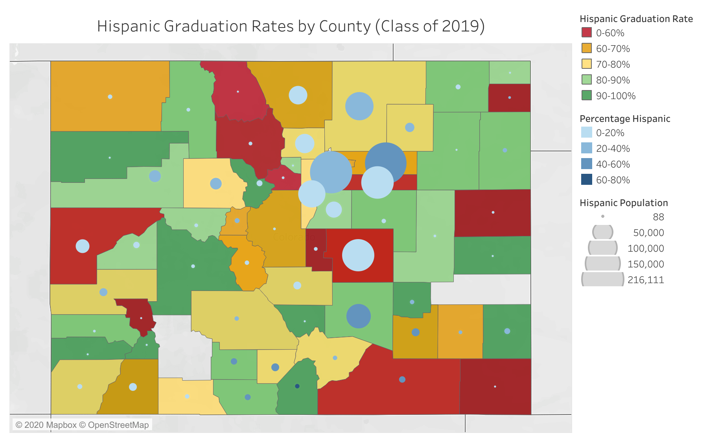</a>

Ths plot shows that there appears to be a negative trend in graduation rates as the population increases. Also, it is important to note that the hispanic graduation rate is considerably lower than that of all compiled races. This disparity seems to get larger in counties with higher population. It may be possible that hispanics in urban counties aren't getting the educational resources they need to succeed.

<a href="https://public.tableau.com/views/COHispanicCounties-Display/GraduationRateperCountybyTotalPopulation?:language=en&:display_count=y&publish=yes&:origin=viz_share_link">
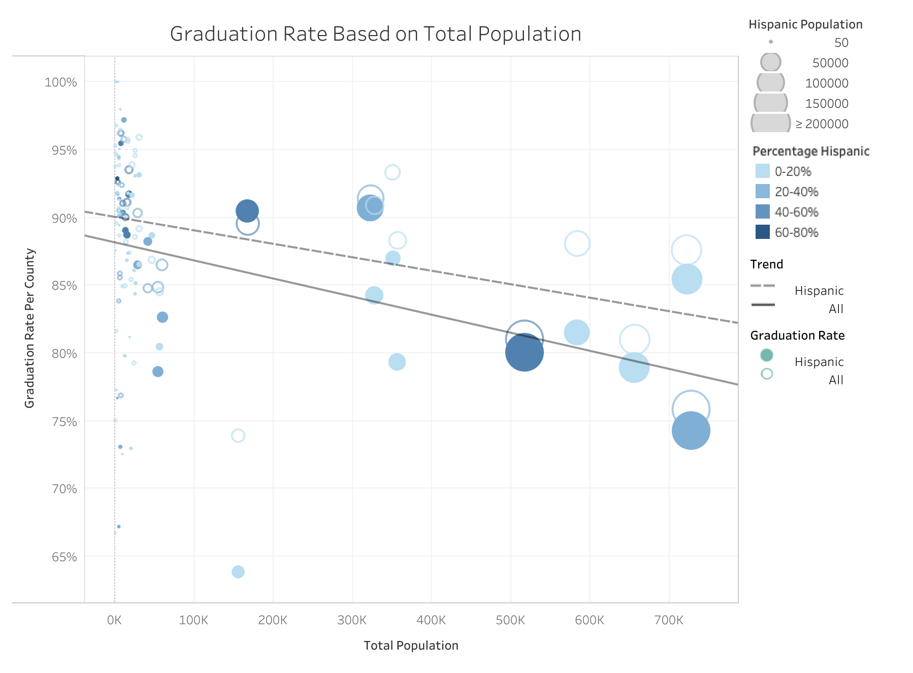</a>

### Graduation Rates by Ethnicity
This bar plot represents the race/ethnicity breakdown of high school graduation rates in the state of Denver. Again, hispanics seem to have rates below the other major races, and they appear worse in Denver county.

<a href="https://public.tableau.com/views/COHispanicCounties-Display/GradRatesbyRace?:language=en&:display_count=y&:origin=viz_share_link">
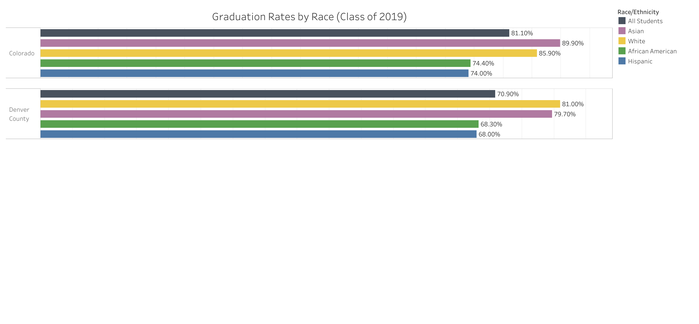</a>

### Female Graduation Rates by Ethnicity
This bar plot represents ethnicity/race breakdown of female graduation races throughout the state and in Denver county. Again, hispanics seem to have lower graduation rates than those of other ethnicities in Colorado.

<a href="https://public.tableau.com/views/COHispanicCounties-Display/FemaleGradRates?:language=en&:display_count=y&:origin=viz_share_link">
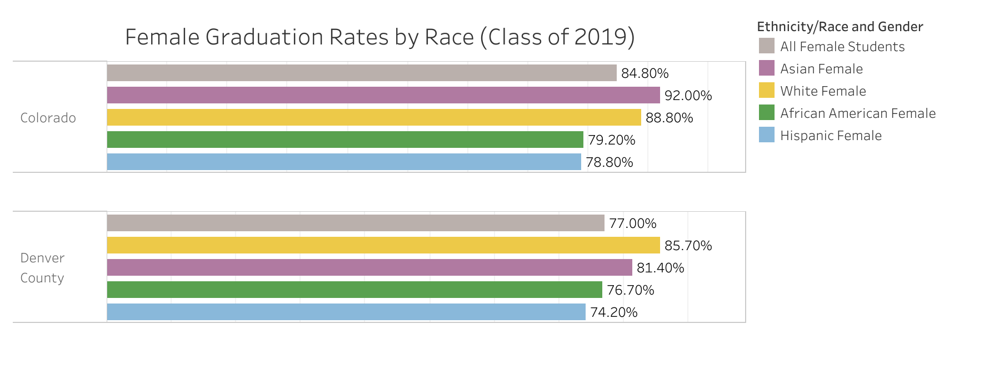</a>

### Male Graduation Rates by Ethnicity
This bar plot represents ethnicity/race breakdown of male graduation races throughout the state and in Denver county. Male hispanics seem to have lower graduation rates than those of other ethnicities as well. It is worth noting that the graduation rates are significantly lower in Denver than throughout the whole state.

<a href="https://public.tableau.com/views/COHispanicCounties-Display/MaleGraduationRatesbyRaceCounty?:language=en&:display_count=y&:origin=viz_share_link">
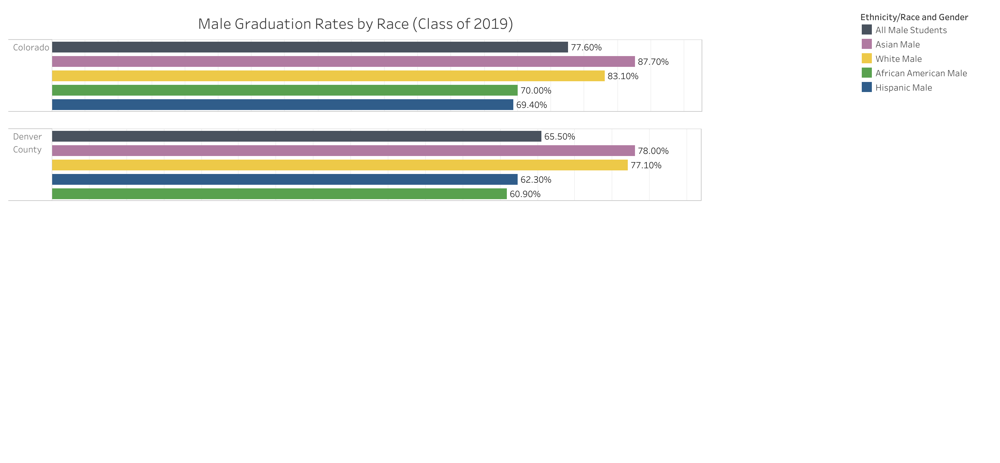</a>

### Hispanic Graduation Rates by Gender/County
From this bar plot, hispanic females seem to have much higher graduation rates than hispanic males. Interestingly, Pueblo County has higher graduation rates for Hispanic males and females than average.

<a href="https://public.tableau.com/views/COHispanicCounties-Display/GraduationRatesPerCounty?:language=en&:display_count=y&publish=yes&:origin=viz_share_link">
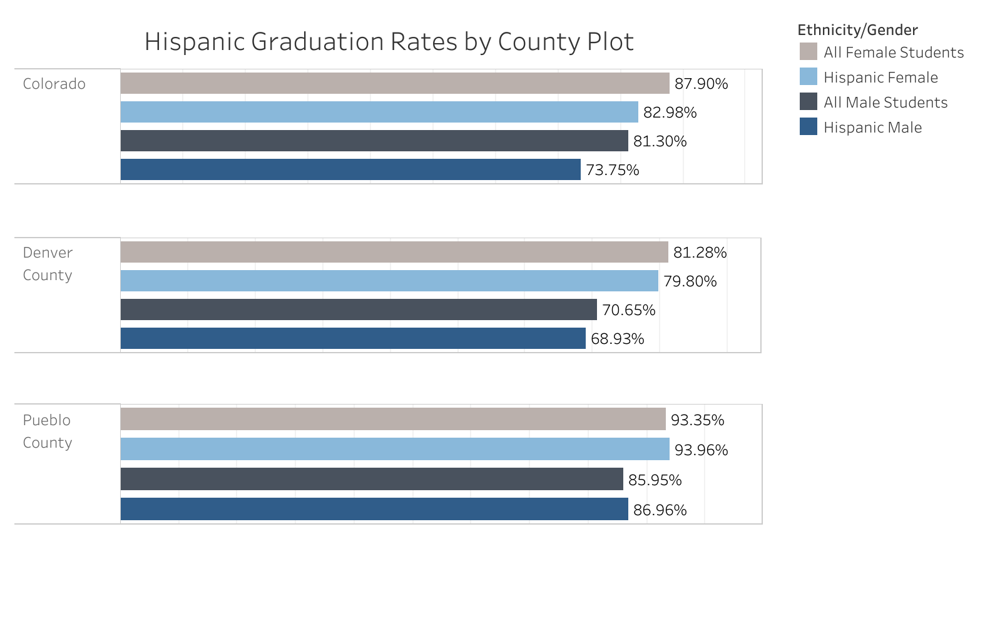</a>

### English Non-Fluency by County
This map shows the average percentage of people per county that do not speak fluent english. Many of the higher rates of nonfluency are in areas of high hispanic concentration.

<a href="https://public.tableau.com/views/COHispanicCounties-Display/EnglishFluency?:language=en&:display_count=y&:origin=viz_share_link">
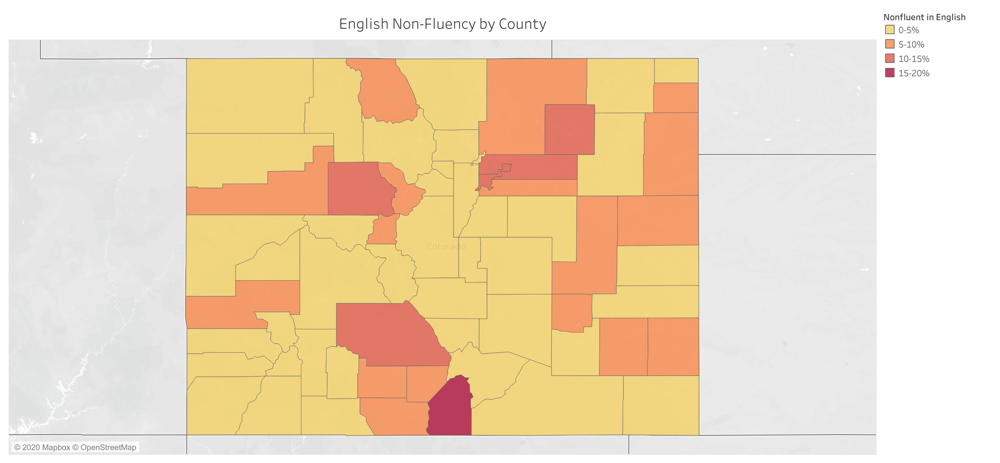</a>

This bar plot shows the percentage of non-english speakers in the counties in colorado with the highest concentration of those not fluent in English. Spanish is definitely the most common non-english language spoken throughout these areas.

<a href="https://public.tableau.com/views/COHispanicCounties-Display/Non-EnglishbyCounty?:language=en&:display_count=y&:origin=viz_share_link">
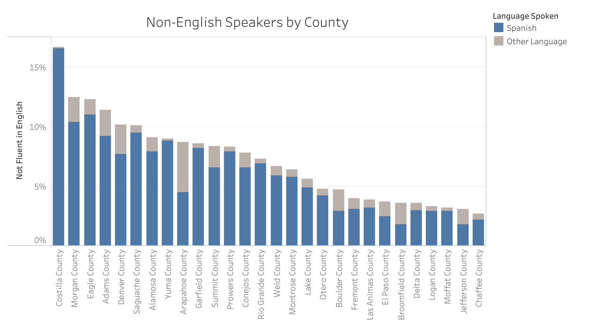</a>

## Food Access

### Denver Low Access (1 mile) and Low Income
Shown is a map of low access, low income census tracts throughout the city of Denver, and the percentage of people affected. The circles on the census tract areas represent the population of hispanic people. Low-income census tracts where a significant number (at least 500 people) or share (at least 33 percent) of the population is greater than 1.0 mile from the nearest supermarket, supercenter, or large grocery store for an urban area or greater than 10 miles for a rural area.

There are two areas of concern, colored orange and red that have high levels of low access. It is worth noting that the orange area is also inside zip code 80216, which has a population that is about 80% hispanic. The zip code 80216 also has very high levels of air pollution.

<a href="https://public.tableau.com/views/FoodDesertsCO-Display/LowAccessLowIncome1MiDenver?:language=en&:display_count=y&publish=yes&:origin=viz_share_link">
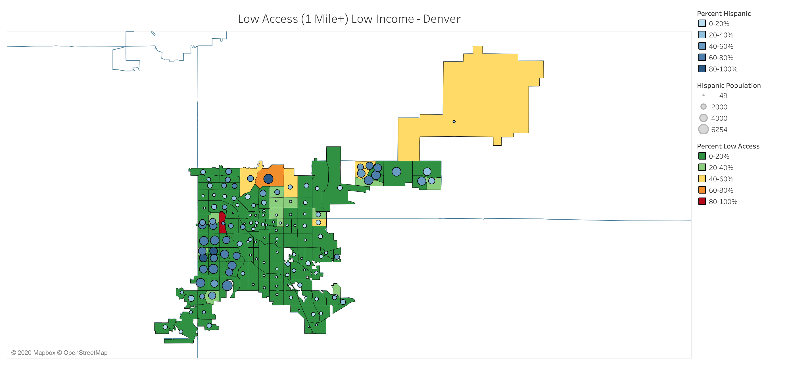</a>

### Metro Denver Low Access (1 mile)
This map represents metro Denver census tracts and the tracts that are considered low access.

<a href="https://public.tableau.com/views/FoodDesertsCO-Display/MetroDenverLowAccessTract1miUrban?:language=en&:display_count=y&:origin=viz_share_link">
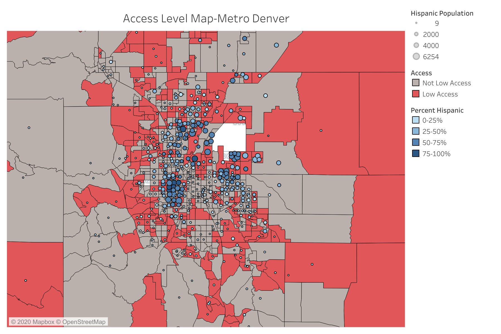</a>

### Denver Low Vehicle Access
This map represents metro Denver census tracts that are low access and a signicant number of people have low access to a vehicle.

<a href="https://public.tableau.com/profile/jacob.budnick#!/vizhome/FoodDesertsCO-Display/DenverLowVehicleAccessMap">
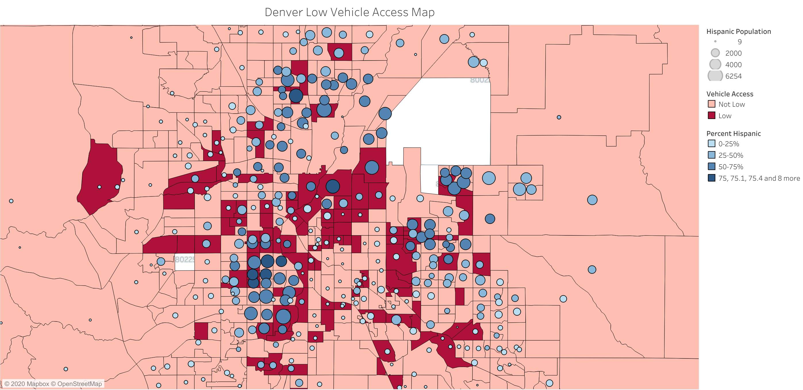</a>

### Low Access (20+ mile) and No Vehicle Access
This plot represents the census tracks in Colorado that are more than 20 miles away from the nearest grocery store or supermarket and have little to no vehicle access. Although not a large quantity of hispanics fall into this category, it is worth noting that the census tracts with the highest percentage of housing units effected also appear to be largely hispanic communities. Costilla County contains the top two census tracts with the highest levels.

<a href="https://public.tableau.com/profile/jacob.budnick#!/vizhome/FoodDesertsCO-Display/LowAccess20miNoVehicleAccessTract">
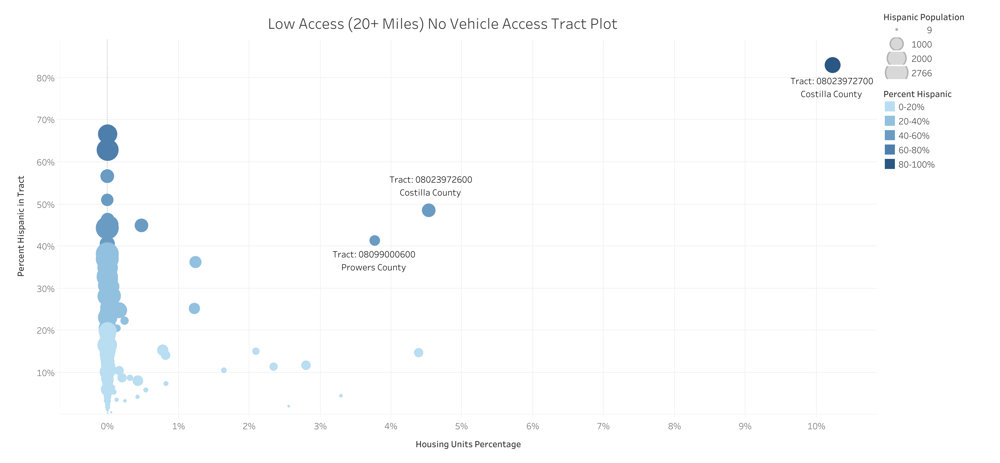</a>

## Future Work:

- Analyze Soil Quality
- Analyze Water Quality

Sources:

Header Image:
https://www.ksut.org/post/covid-19-colorado-and-four-corners-numbers#stream/0

AQI Data Source:
https://www.epa.gov/outdoor-air-quality-data/about-air-data-reports#aqi

Air pollution by county
https://www.epa.gov/outdoor-air-quality-data/air-quality-index-report

Soil Quality: 
https://ncsslabdatamart.sc.egov.usda.gov/querypage.aspx

Census Info: English speaker, etc level of highest education
https://data.census.gov/cedsci/table?d=ACS%205-Year%20Estimates%20Data%20Profiles&table=DP02&tid=ACSDP5Y2018.DP02&y=2018&g=0400000US08,08.050000&hidePreview=true&moe=false

Population by zip code Source:
http://zipatlas.com/us/co/zip-code-comparison/percentage-hispanic-population.htm

Denver Post: Top 20 polluted Zip Codes
https://www.denverpost.com/2017/02/16/colorado-most-polluted-zip-codes/

Grad Rate Data source: 
https://www.cde.state.co.us/cdereval/gradratecurrent

English Non-fluency Data Source: 
https://data.census.gov/cedsci/table?d=ACS%205-Year%20Estimates%20Data%20Profiles&table=DP02&tid=ACSDP5Y2018.DP02&y=2018&g=0400000US08,08.050000&hidePreview=true&moe=false

Low Access Definition Source : https://www.ers.usda.gov/data-products/food-access-research-atlas/documentation/ 

Food Desert Source:
https://data-cdphe.opendata.arcgis.com/datasets/755f5bf71cbc4b98b1c22785f3fe14ae_0?geometry=-112.745%2C37.404%2C-97.089%2C40.396&page=8&selectedAttribute=lahunv20share

Race/Ethnicity by Census Tract:
https://data-cdphe.opendata.arcgis.com/datasets/f64104fe9a07488da9d9f95c2c5238a1_7?selectedAttribute=Ethinicity_Hispanic_Latino
